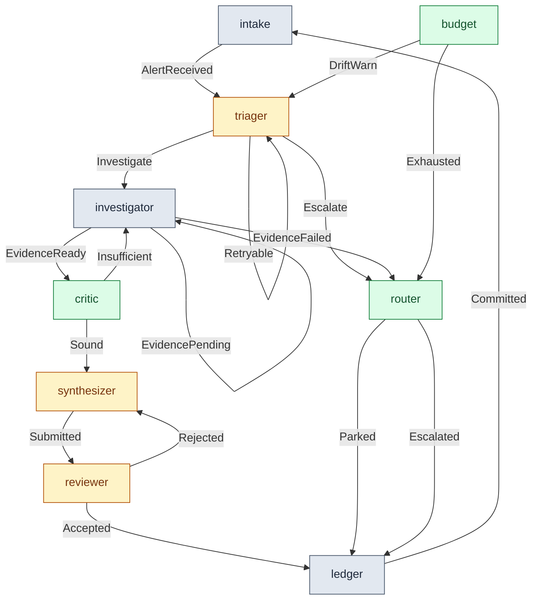
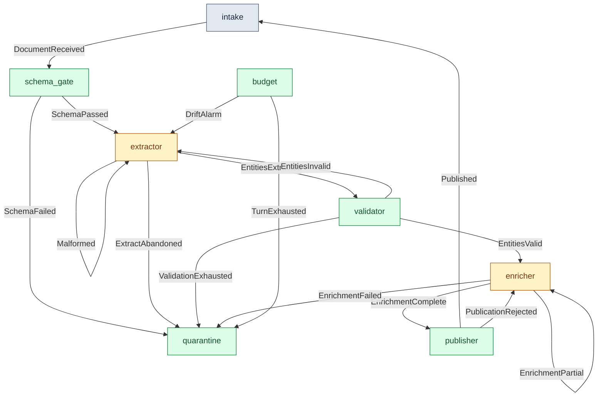
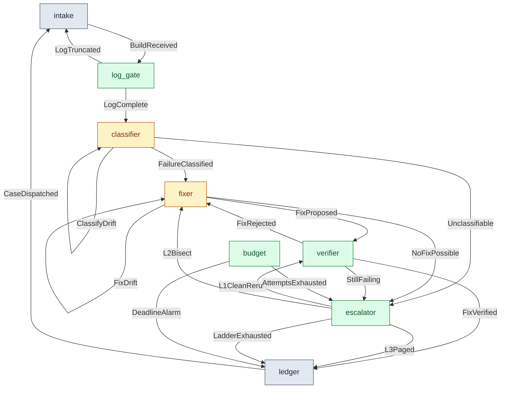

<div align="center">

# Gauntlet — 拓扑级 Harness 一致性测试与变异分析框架

**Topology-Grounded Conformance Testing, Fault Injection & Mutation Analysis for LLM Agent Harnesses**

[](LICENSE)
[](docs/GENERALIZATION.md)
[](vendor/dhv-ts)
[-orange.svg)](scenarios)
[](results/report.md)
[%20%C2%B7%20100%25%20(归因后)-yellow.svg)](results/report.md)
[](docs/TOPO-LINT.md)

</div>

---

> **一句话定位**：LLM Agent harness 的测试方法论长期缺位于「代码覆盖率」（对非确定性 Agent 毫无意义）与「端到端评测」（黑盒、无结构判据）之间。Gauntlet 把 harness 的**声明拓扑**（`@graph` / `node` / `edge ... on Guard`）当作可测试契约，在它之上重建经典测试三大支柱——**覆盖率、故障注入、变异测试**——并以事件总线为观测面机械执行。

## 目录

- [为什么需要 Gauntlet](#为什么需要-gauntlet)
- [方法论：两平面契约对齐](#方法论两平面契约对齐)
- [框架架构](#框架架构)
- [核心实证结果（全部可复现）](#核心实证结果全部可复现)
- [三个 SUT：刻意不同构的拓扑结构签名](#三个-sut刻意不同构的拓扑结构签名)
- [拓扑可观测性 lint（G-7 / G-8 / G-9）](#拓扑可观测性-lintg-7--g-8--g-9)
- [故障注入：Harness 故障分类学](#故障注入harness-故障分类学)
- [变异测试：harness 拓扑变异算子](#变异测试harness-拓扑变异算子)
- [15 分钟上手](#15-分钟上手)
- [仓库结构](#仓库结构)
- [对上游 HSL 的贡献](#对上游-hsl-的贡献)
- [诚实边界（已知局限）](#诚实边界已知局限)
- [文档索引](#文档索引)
- [引用](#引用)
- [许可](#许可)

## 为什么需要 Gauntlet

对一个由 LLM 驱动的 agent harness 做「测试」，业界现状只有两个极端，都不够用：

| 现有做法 | 为什么对 harness 失效 |
|:---|:---|
| **代码覆盖率**（line/branch） | harness 的行为契约不在代码行里，而在**编排拓扑**里——改一行代码可能根本不改拓扑，改一条边却改变全部行为语义；且 LLM 调用点非确定，行覆盖与行为正确性脱钩 |
| **端到端评测**（benchmark 打分） | 黑盒：只看最终产出，不回答「哪些编排路径被执行过」「哪条边从未被触发」「harness 对协议漂移/权限拒绝/预算耗尽的编排响应是否被测过」 |
| **运行期 chaos 注入**（agent-chaos 类） | 有故障注入，但**没有静态拓扑作为 ground truth**——注入结果没有结构判据可对拍，覆盖也无从谈起 |
| **形式化验证**（AgentVerify 类） | 把 LLM 当非确定性 oracle 做 FSM 验证，重量级且与工程化 harness 描述语言脱节 |

**空白点（立项动机）**：没有人把协议一致性测试的经典方法论——覆盖率准则、确定性故障注入、变异分析——落到 harness 的**静态声明拓扑**上。HSL 恰好提供了这个声明平面：graph 声明即契约、事件总线即观测面、守卫即触发语义。Gauntlet 补的就是这一块。

## 方法论：两平面契约对齐

Gauntlet 的一切判据都建立在一个核心对齐关系上——**声明的拓扑 vs 观测的事件**：

```
声明平面（静态）                     观测平面（运行时）
─────────────────────              ─────────────────────
edge  a ──on G──► b        ◄──────►  事件总线 edge 事件 {graph, from, to, on, scale}
node  x                         ◄──────►  node 事件
guard G                         ◄──────►  恰有一个 match 臂命中时发射（G-9：空臂也发射）
```

- **对齐失败有两种方向**：声明了但观测不到（dsh 实证：`executor→model on Observed` 边从未发射 → G-7）；观测到了但声明不成立（守卫别名多边同发 → G-8 唯一守卫纪律）。
- 在对齐之上重建**三大支柱**：

| 支柱 | 经典测试 | Gauntlet 的拓扑级对应物 |
|:---|:---|:---|
| **覆盖率** | line / branch coverage | **edge / node / guard coverage**：以声明边全集为分母，事件总线触发边为分子；衍生 **fault-only 边**（nominal 套件结构性不可达的边）作为故障注入必要性的直接证据 |
| **故障注入** | 依赖故障 / 杀进程 | **Harness 故障分类学**（模型协议漂移 / 工具缺失·损坏·拒绝 / 审查驳回 / 预算耗尽…），在宿主 API 边界确定性触发，全程事件可观测 |
| **变异测试** | 变异算子 + 杀死率 | **首组 harness 拓扑变异算子 M1-M8**（删边 / 改边端点 / 换守卫 / 预算 off-by-one / 闸门翻转…），变异体重跑全场景与黄金预期对拍 → 杀死率 |
| （横切）**轨迹不变式** | property-based 断言 | 事件序列上的**时序 / 守恒 / 因果**性质（Accepted 必后随 Committed；fan-in 汇聚守恒；L2 必在 L1 后…），比逐场景黄金对比更结构化的失败语义 |

## 框架架构

```mermaid
flowchart TB
  subgraph SUT["SUT 平面 · 三个刻意不同构的域（纯 HSL 编写）"]
    direction LR
    V["Vigil · SRE 告警分诊<br/>fan-out router · 9n / 17e / 5 环"]
    C["Curator · 文档策展<br/>fan-in 隔离 · 8n / 16e / 4 环"]
    GM["Gatemaster · CI 失败分诊<br/>escalation ladder · 8n / 19e / 6 环"]
    BIND["subject/&lt;id&gt;/binding.ts —— 每域一份声明式绑定<br/>场景目录（黄金预期）· 不变式目录 · 变异目录<br/>框架侧 SUT 专属代码 = 0 行"]
  end

  subgraph STATIC["① 声明平面 · 静态分析（topo.ts → lint.ts）"]
    direction LR
    TOPO["拓扑提取<br/>.hsl → nodes / edges / guards JSON"]
    LINT["拓扑 lint<br/>G-7 声明可观测 · G-8 守卫唯一 · G-9 空臂发射"]
    TOPO --> LINT
  end

  subgraph DYN["② 观测平面 · 每场景一个子进程（runner.ts）"]
    direction LR
    FIXT["Fixture v2 多轨道剧本<br/>$host.fixture.next&#40;track&#41;"]
    FAULTS["故障计划 · 宿主 API 闸门<br/>error · deny · empty · corrupt · slow"]
    DHV["dhv-ts 解释器（vendor）<br/>--model scripted 确定性"]
    BUS["事件总线 events.jsonl<br/>edge · node · fault_injected · capability_denied"]
    FIXT --> DHV
    FAULTS --> DHV
    DHV --> BUS
  end

  subgraph JUDGE["③ 判定平面 · 机械判据（无人工口径）"]
    GOLD["黄金五维断言<br/>exit · verdict · dispositions<br/>faultEvents · deniedEvents"]
    COV["coverage.ts<br/>Edge coverage<br/>+ fault-only 边分析"]
    INV["invariants.ts<br/>轨迹不变式<br/>时序 / 守恒 / 因果"]
    MUT["mutate.ts<br/>M1-M8 变异体 × 全场景<br/>并行池 × 4"]
    TRI["triage.ts<br/>存活体静态等价归因"]
    MUT --> TRI
  end

  REPORT["report.ts → report.md + gauntlet.json<br/>per-SUT + 三域聚合 · 全部数字可复现"]

  SUT --> TOPO
  LINT -- "G-7 / G-8 / G-9 全绿门" --> DYN
  BIND -.-> DYN
  BIND -.-> INV
  BIND -.-> MUT
  DYN --> GOLD
  DYN --> COV
  DYN --> INV
  MUT -. "变异体：重写 .hsl 后重跑全场景" .-> DYN
  GOLD --> REPORT
  COV --> REPORT
  INV --> REPORT
  TRI --> REPORT
```



**三个关键设计决策**：

1. **子进程契约**：每个场景以独立子进程运行 SUT（`bun dhv-ts run subject.hsl --workspace ws --fixture fx.json`），框架只消费 `exit code / report.md / events.jsonl` 三件产物——SUT 与框架物理隔离，无共享状态，可并行。
2. **SUT 无关性**：框架层 11 个 TS 模块（`gauntlet/`）不含任何 SUT 名字；接入第三域 Gatemaster 时框架改动 0 行（仅注册表 +1 行）。对照实验记录见 [GENERALIZATION.md](docs/GENERALIZATION.md)。
3. **确定性优先**：全部 47 个场景用 scripted 模型轨道剧本驱动（零外联、毫秒级、逐字节可复现），LLM 的非确定性被隔离在「可替换端口」处——这使黄金断言与变异杀死率有明确语义。

| 模块 | 职责 |
|:---|:---|
| [`topo.ts`](gauntlet/topo.ts) | 静态拓扑提取：`.hsl` → nodes / edges / guards JSON（后续一切判据的 ground truth） |
| [`lint.ts`](gauntlet/lint.ts) | G-7 / G-8 / G-9 拓扑可观测性纪律（含 scrutinee 定向可达集分析） |
| [`runner.ts`](gauntlet/runner.ts) | 场景运行器：子进程契约 + 黄金五维断言 + 观测向量提取 |
| [`coverage.ts`](gauntlet/coverage.ts) | 声明边 vs 触发边 → edge coverage + fault-only 边集 |
| [`invariants.ts`](gauntlet/invariants.ts) | `Invariant` 接口 + 检查器（目录经 binding 注入） |
| [`mutate.ts`](gauntlet/mutate.ts) | 变异引擎：M1-M8 算子族（变异点由 binding 声明）+ 并行池 ×4 |
| [`triage.ts`](gauntlet/triage.ts) | 存活变异体的**静态等价归因**（含负控样本集） |
| [`subject.ts`](gauntlet/subject.ts) | SUT 注册表（`SubjectSpec`）—— 多 SUT 泛化层 |
| [`report.ts`](gauntlet/report.ts) | `report.md` + `gauntlet.json` 双产物（per-SUT + 聚合） |

## 核心实证结果（全部可复现）

| 指标 | Vigil（SRE 分诊） | Curator（文档策展） | Gatemaster（CI 分诊） | 含义 |
|:---|:---|:---|:---|:---|
| **结构签名** | fan-out router（9n/17e/5环） | fan-in sink（8n/16e/4环） | escalation ladder（8n/19e/6环） | 三种拓扑结构签名的对照实验 |
| **Edge coverage** | **100%**（17/17） | **100%**（16/16） | **100%**（19/19） | 拓扑作为 ground truth 的可观测契约 |
| **Fault-only 边** | 6 条（**35%**） | 8 条（**50%**） | **11 条（58%）** | nominal 套件结构性盲区——故障注入不是可选项，是覆盖的必要条件 |
| **场景一致性** | 15/15 全绿 | 15/15 全绿 | 17/17 全绿 | exit / verdict / disposition / 故障事件数 / 拒绝事件数 五维黄金断言，确定性零外联 |
| **轨迹不变式** | 11/11 满足 | 11/11 满足 | 11/11 满足（含阶梯单调性） | Accepted→Committed 时序 / fan-in 收敛守恒 / L2 必在 L1 后… |
| **变异杀死率** | 96.3%（26/27）→ **归因后 100%** | **100%（26/26）** | **100%（29/29）** | 聚合 81/82 = 98.8%；Vigil 唯一存活体经 **triage 静态判定器自动归因** |
| **框架 SUT 专属代码** | — | — | — | **0 行**（第三 SUT 接入零框架改动） |
| **G-7 lint 交叉验证** | dsh 的 `executor→model on Observed` 边被静态抓出（真实运行从未发射） | 同 lint 三 SUT 全过 | 同左 | 立项动机被工具实证 |

> 复现：`bun gauntlet/cli.ts all`（三 SUT 全流水线 + 聚合报告，~3-4 分钟）；最新一轮产物见 [results/report.md](results/report.md)。

## 三个 SUT：刻意不同构的拓扑结构签名

泛化主张（n=1 → n=3）：框架方法论不依赖某个具体拓扑。三个域分别选取**结构签名不同**的拓扑形态——路由扇出、汇聚隔离、阶梯升级——覆盖「router / sink / staircase」三类常见 harness 骨架。

图例：🟡 琥珀 = LLM 可插端口（scripted 剧本或 live LLM）· 🟢 绿 = 确定性闸门（非 LLM，可验证性锚点）· ⚪ 灰 = 收发 / 账本

### SUT #1 Vigil —— fan-out router（SRE 告警分诊）



9 节点 / 17 边 / 5 守卫环。分诊路由扇出三路处置（investigate / escalate / retry 自环）；审查驳回返工回环（reviewer→synthesizer）；外层告警回环（ledger→intake）。LLM 端口：`triage / synthesize / review`。

### SUT #2 Curator —— fan-in sink（文档策展管线）



8 节点 / 16 边 / 4 守卫环。与 Vigil 相反的签名：五路失败边**汇聚**到隔离区（quarantine fan-in）——「坏文档收容」而非「好路径分发」；提取/校验双返工回环。LLM 端口：`extract / enrich`。

### SUT #3 Gatemaster —— escalation ladder（CI 失败分诊）



8 节点 / 19 边 / 6 守卫环。第三种结构签名——**阶梯升级**：L1 清洁重跑（flaky 容忍，无新模型调用）→ L2 bisect 证据回注（重提案）→ L3 人工 paging；梯耗尽 / 修复预算耗尽 / 会话死线三路放弃收束。**阶梯单调性**（L2 必在 L1 后）是本签名独有的不变式形态——不变式目录的形态本身由拓扑结构签名决定（[GENERALIZATION.md §6.4](docs/GENERALIZATION.md)）。LLM 端口：`classify / fix`。

## 拓扑可观测性 lint（G-7 / G-8 / G-9）

声明拓扑要成为可测试契约，前提是**声明与观测对齐**。三条纪律已在 `gauntlet/lint.ts` 工具化（[TOPO-LINT.md](docs/TOPO-LINT.md)）：

| 规则 | 内容 | 实证 |
|:---|:---|:---|
| **G-7 可观测性** | 每条边的 Guard 变体必须出现在全程序某个 `match` 臂中——否则该边在事件总线上**结构性不可观测**（永不发射） | dsh（DeepSeek Harness 的 HSL 复现）的 `executor→model on Event::Observed` 被静态抓出，真实运行确实从未发射 |
| **G-8 唯一守卫** | 同一守卫变体不得出现在多条边（守卫别名）——否则事件发射粒度与声明粒度失配，边覆盖语义被破坏 | 三 SUT 设计期即遵守（守卫全局唯一） |
| **G-9 空臂发射** | 挂边守卫变体的 `match` 臂若为空臂且 scrutinee 可达集包含该变体 → 告警：穷尽 match 的空臂照样发射其声明边事件（「臂执行记录」≠「转移语义」），计数型守恒不变式必须按臂执行计数 | Gatemaster gf9 校准期实证（#L-23），RED 注入精确命中 |

## 故障注入：Harness 故障分类学

故障计划在剧本 JSON 内声明，在**宿主 API 边界**（`fs.read` / 模型轨道等）确定性触发，全程事件可观测：

```json
{
  "tracks": {
    "inbox":   ["{\"id\":\"ALT-001\",\"source\":\"prometheus\",...}"],
    "triage":  ["{\"decision\":\"investigate\",\"hypothesis\":\"...\"}"],
    "synthesize": ["{\"text\":\"Postmortem: ...\"}"],
    "review": ["{\"verdict\":\"accept\"}"]
  },
  "faults": [
    { "target": "fs.read", "nth": 1, "kind": "corrupt", "message": "telemetry corrupted in transit" }
  ]
}
```

注入类别：`error`（抛错）/ `deny`（权限拒绝 + `capability_denied` 事件）/ `empty` / `corrupt`（返回值截断）/ `slow`（延迟，仅异步目标）。

**分类学**（[FAULT-TAXONOMY.md](docs/FAULT-TAXONOMY.md)）——每类都是「harness 编排层的失效模式」，而非模型能力或基础设施问题：

| 类 | 故障 | 注入通道 | 三 SUT 实例数 |
|:---|:---|:---|:---|
| A1 | 模型协议漂移（可恢复→重试/回环） | 轨道剧本返回畸形 payload | vigil 2 · curator 2 · gatemaster 2 |
| A2 | 模型协议漂移（不可恢复→预算收束） | 持续畸形 + 漂移预算耗尽 | 三域均有 |
| A2' | 模型词表外 / 显式放弃 | 语义外类别 / give-up 信号 | gatemaster 2 |
| B1 | 工具缺失 | 目标文件不存在 | 三域均有 |
| B2 | 工具损坏（返回值截断） | `corrupt` | 三域均有 |
| B3 | 权限拒绝 | `deny` + capability 撤销 | 三域均有 |
| C1 | 证据不足回环 | 轨道剧本与假设无关 | vigil 1 |
| D1/D2 | 审查驳回（恢复 / 耗尽升级） | review 轨道 verdict 序列 | vigil 2 · curator 1 |
| E1 | 预算耗尽（轮次 / 修复次数 / 死线） | 预算信号触发 | 三域均有 |

> fault-only 边是这套分类学的直接产出：35 个故障场景驱动出 52 条声明边中 25 条（48%）nominal 结构性不可达的边——**没有故障注入，一半的拓扑契约从未被检验过**。

## 变异测试：harness 拓扑变异算子

首组面向 harness 声明拓扑的变异算子（[PAPER.md](docs/PAPER.md) §5）：每个变异体重写 `.hsl` 源码后重跑全场景，与黄金预期对拍；存活体进入 triage 静态等价归因。

| 算子 | 变异语义 | 实例 |
|:---|:---|:---|
| **M1 EDGE_DEL** | 删除一条边声明（拓扑契约变异：事件流缺边） | 每域全边逐一删除（17+16+19 = 52 个） |
| **M2 EDGE_REDIRECT** | 改写边端点（拓扑签名变异） | 提案跳过验证直达升梯 / L1 直达落账… |
| **M3 GUARD_SWAP** | 改写边守卫（触发条件变异） | 换成守卫别名 / 语义漂移守卫 |
| **M4 BUDGET_OFF** | 预算边界 off-by-one（`>=` → `>`） | 死线边界 |
| **M5 GATE_FLIP** | 路由 / 闸门条件翻转 | 日志闸最小长度 40→0 |
| **M6 VERIFY_THRESH** | 审查 / 校验闸门阈值松动 | flaky 容忍门移除 |
| **M7 DRIFT_CAP** | 漂移硬上限提升（×2 → ×3） | 会话漂移预算 |
| **M8 COMMIT_DROP** | 提交 / 发布路径丢弃案例落盘 | fixed 落账丢弃 |

结果：82 变异体 · 81 killed（98.8%）· 唯一存活体（Vigil M2-R3）经 triage 判定为**黄金等价**（重定向后的行为差异超出口径但语义等价）→ 归因后有效杀死率 100%。判定器自身带负控样本集（covering 真可变 / 未门控 / 乘法上限三类正确拒绝）——「判定等价的误报风险与等价声明同级」。

## 15 分钟上手

```bash
# 依赖：bun ≥ 1.1（解释器 vendor 零 npm 依赖）
git clone https://github.com/myh2026/hsl-gauntlet.git && cd hsl-gauntlet

# 1) 拓扑提取 + G-7/G-8/G-9 lint
bun gauntlet/cli.ts topo
bun gauntlet/cli.ts lint

# 2) 三 SUT 场景一致性 + 不变式 + 覆盖率
bun gauntlet/cli.ts run                      # Vigil + Curator + Gatemaster 共 47 场景
bun gauntlet/cli.ts run --subject gatemaster # 只跑 Gatemaster

# 3) 变异测试（每 SUT 基线 + 27/26/29 变异体 × 场景，池深 4）
bun gauntlet/cli.ts mutate

# 4) 全流水线 + 报告（三 SUT 聚合，~3-4 分钟）
bun gauntlet/cli.ts all          # → results/report.md（含跨 SUT 对比表）
bash scripts/run-all.sh          # 同上（含 check 前置）

# 单场景手工运行（理解运行时行为）
bun vendor/dhv-ts/src/main.ts run subject/vigil/vigil.hsl \
  --workspace scenarios/nominal/ws-n1 --task "demo" --model scripted \
  --fixture scenarios/nominal/n1.json --out /tmp/vigil-demo
cat /tmp/vigil-demo/report.md     # 会话报告
cat /tmp/vigil-demo/events.jsonl  # 事件总线（edge/node/fault_injected）
```

## 仓库结构

```
hsl-gauntlet/
├── gauntlet/          框架本体（11 个 TS 模块，bun 运行，SUT 无关）
├── subject/vigil/     SUT #1：SRE 告警分诊 harness（15 HSL 模块 + binding.ts）
├── subject/curator/   SUT #2：文档策展管线 harness（15 HSL 模块 + binding.ts）
├── subject/gatemaster/ SUT #3：CI 失败分诊 harness（15 HSL 模块 + binding.ts）
├── scenarios/         47 个确定性场景（vigil 15 + curator 15 + gatemaster 17：多轨道 fixture + 工作区 + 故障注入计划）
├── vendor/dhv-ts/     解释器 vendor（Fixture v2 多轨道剧本 + 故障注入宿主闸门）
├── docs/              论文草案与评估文档（见下方索引）
└── results/           report.md / gauntlet.json（运行产物）
```

## 对上游 HSL 的贡献（已实测合入 branch）

| 项 | 内容 |
|:---|:---|
| **Host Fixture v2** | `$host.fixture.next(track)` 多轨道剧本 + 故障注入宿主闸门（向后兼容，dsh 回归绿） |
| **L-1/L-2 别名修复** | `import { T as A }` 的构造位/模式位/检查位三通道解析一致（+2 回归用例） |
| **G-7/G-8/G-9 提案** | 拓扑可观测性纪律（lint 已实证 dsh 的结构性盲区边与空臂发射语义） |
| **S-13~S-18 / L-4~L-23** | 十轮语言实测战役：字面量域 / 溢出 / 重复边 / cast 折叠 / 值损坏三连 / emit 行为级七连修 / native 值模型断层（`$host.make` 构造通道 + 预警）/ 空臂发射语义；上游测试 **111 → 158**，双编译器一致 **39 → 66**（含值级 / 行为级 / 预警对等四层） |

## 诚实边界（已知局限）

- **scripted ≠ live**：全部 47 场景用确定性剧本轨道驱动。LLM 端口可替换为 live 模型（z-ai 网关），但 live 下的概率覆盖语义是下一步工作（PAPER.md §7）。
- **G-9 可达集分析是启发式**：同名 fn 并集保守 / 4 层回溯上限 / 复杂 scrutinee 表达式降级为 warning（宁报不漏）。
- **triage v1 只认识计划门不变式一种模式**：fan-in 汇聚计数、阶梯单调性等形态的静态等价判定留后续。
- **native python 块无 `$host` 注入**：`$host.make` 构造通道仅 ts/js 后端可用（文档已标注）。

## 文档索引

| 文档 | 内容 |
|:---|:---|
| [PAPER.md](docs/PAPER.md) | 论文草案：方法论、覆盖准则形式化、变异算子族、效度威胁 |
| [GENERALIZATION.md](docs/GENERALIZATION.md) | 三域 SUT 泛化实验：对照设计、耦合分析（0 行框架改动）、结构签名 §6 |
| [LANGUAGE-EVALUATION.md](docs/LANGUAGE-EVALUATION.md) | HSL 语言实战评估：十轮实测、S/L 系列问题全录、十一课 |
| [FAULT-TAXONOMY.md](docs/FAULT-TAXONOMY.md) | Harness 故障分类学：逐类注入机制 → 拓扑后果 → 断言判据 |
| [TOPO-LINT.md](docs/TOPO-LINT.md) | G-7 / G-8 / G-9：规则、动机、实现口径、实测矩阵、修复模式 |

## 引用

```bibtex
@software{hsl_gauntlet_2026,
  author       = {myh2026},
  title        = {Gauntlet: Topology-Grounded Conformance Testing, Fault Injection and Mutation Analysis for LLM Agent Harnesses},
  year         = {2026},
  url          = {https://github.com/myh2026/hsl-gauntlet},
  license      = {MIT}
}
```

## 许可

MIT —— 见 [LICENSE](LICENSE)。基于 [harness-specification-language](https://github.com/myh2026/harness-specification-language)（MIT）的工具链 vendor。
